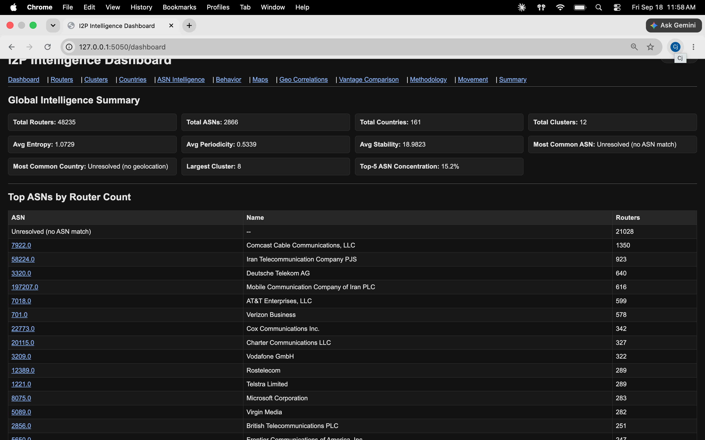
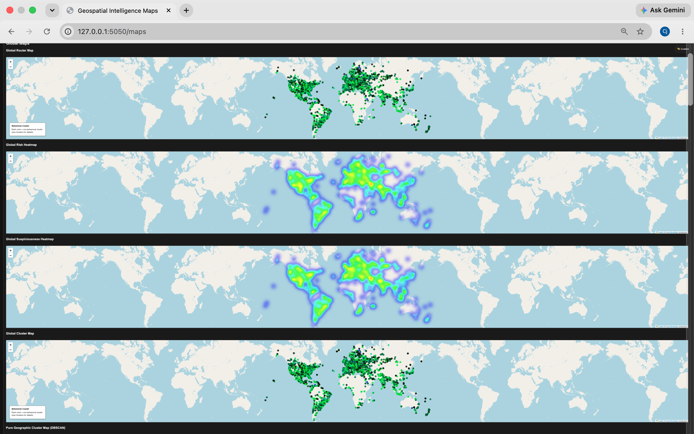
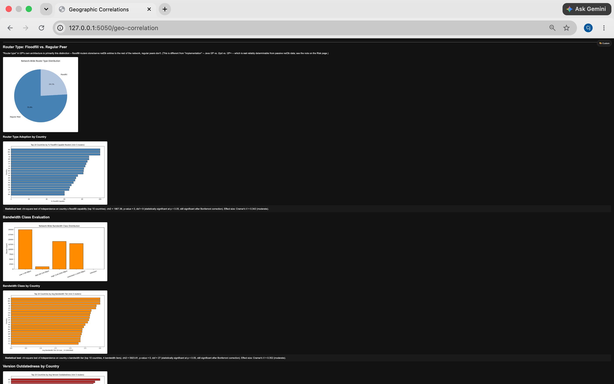
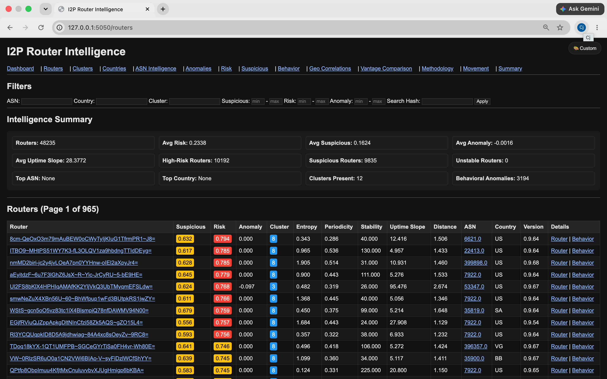
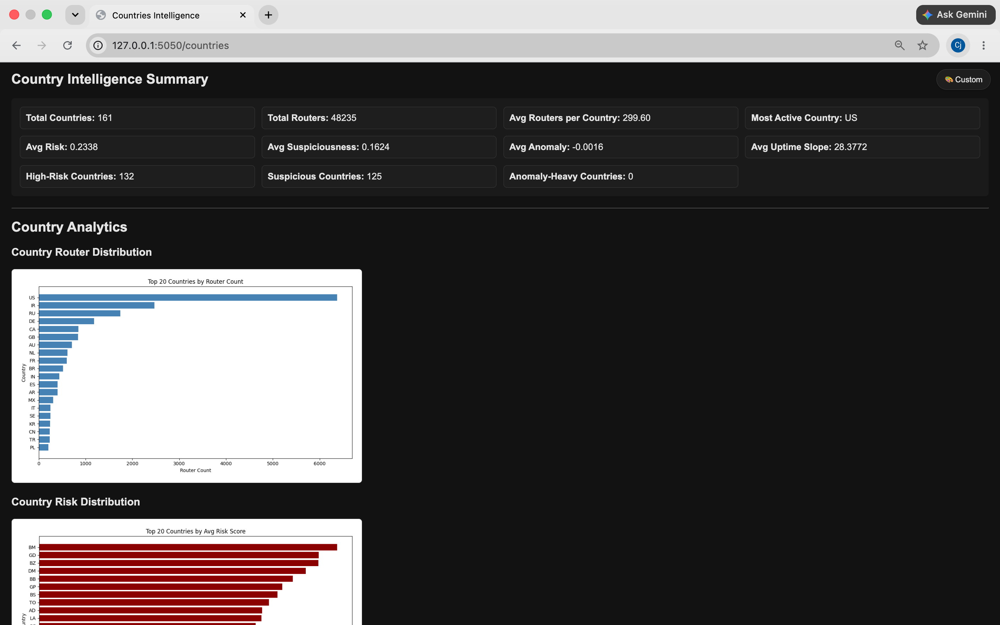

# I2P Network Measurement

A two vantage point measurement study of the I2P anonymity network, with the
full collection and analysis pipeline that produced it.

Over ten days in July 2026 this system observed **48,235 distinct routers
across 161 countries and 2,866 Autonomous Systems**, from roughly 789,000
observations. Collection was entirely passive: it reads the `routerInfo`
records that routers publish about themselves and gossip to each other, and
never probes a peer, inspects traffic, or interacts with any service on the
network.

Full write-up: [`docs/Global Measurement and Geospatial Analysis of the I2P Network.pdf`](docs/)

## Why two routers

I2P has no directory authority. Unlike Tor, there is no signed consensus
document listing the network, so each router knows only what its own gossip
happened to reach. A single observation point therefore sees a partial and
unmeasurable slice.

To quantify that, collection ran from two vantage points at once: the Java I2P
router and i2pd, a separate C++ implementation, on the same machine in the same
window.

**They overlapped on about 30% of what they saw, every day.** Each missed
roughly two thirds of the other's view. Any single vantage point study of I2P
undercounts the network by an amount it cannot measure from the inside.

## Selected findings

- **Client implementation cannot be fingerprinted from netDb data.** Routers
  advertise the protocol version they speak, not the software running them.
  Both vantage points reported the same version string despite being different
  programs. This was an original research question, and the negative result is
  reported as a methodological finding.
- **Geography is structurally associated with router behavior.** Floodfill
  capability and bandwidth tier vary by country at moderate effect sizes
  (Cramér's V = 0.34 and 0.35), significant under a Bonferroni corrected
  threshold. Population size and version currency are independent dimensions.
- **Iran's population is structurally distinct.** Second largest by router
  count (2,471), with 2,442 routers in a single dense cluster centered on
  Tehran rather than spread nationally, and more than half concentrated in two
  state linked telecom ASNs. Its floodfill rate is 8.4% against 48.9% in the
  US. The pattern is consistent with circumvention driven usage over state
  infrastructure, which router data alone cannot prove.

Figures are in [`docs/figures/`](docs/figures).

## The dashboard

The Flask application is how the results were actually explored. It is not
included as a live demo, since it reads the database that is deliberately not
published (see Data availability), but these are real pages from the study.

**Global summary and provider concentration.** Note that two of the largest
providers on the network are Iranian telecoms, which is where the geographic
analysis started.



**Geospatial views.** Router distribution, risk and suspiciousness heatmaps,
and behavioral clusters, all rendered from the same enriched table.



**Geographic correlation.** Each figure carries the statistical test behind it,
including chi-square, degrees of freedom, Bonferroni-corrected significance,
and the Cramér's V effect size, so a reader can judge the strength of the
association rather than just its p-value.



**Router inventory.** Every observed router with its behavioral metrics:
suspiciousness, risk, anomaly score, cluster, entropy, periodicity, stability,
uptime slope, and distance from its behavioral cluster centroid.



**Country intelligence.** Per-country aggregates across the same metrics.



**On the "Unresolved" rows.** Just over half the observed network is IPv6-only,
and MaxMind's GeoLite2 coverage is sparser for IPv6 than for IPv4. ASN resolves
for 56% of routers and coordinates for 48%, so the unresolved bucket outranks
every individual ASN and country, and every geographic result in this study is
computed over that resolved subset rather than all 48,235 routers. This is a
limitation of commercial geolocation data, not of the collection: every router
observed here publishes a reachable address, and ASN and country are derived
from it afterward rather than being something routers advertise.

## Pipeline

Nine stages, run end to end every 30 minutes:

1. **Ingest** raw netDb records. i2pd's binary format is parsed by a custom
   decoder with a text scanning fallback; Java I2P's is read by loading the
   router's own classes through JPype rather than re-implementing the format.
2. **Timeseries and churn** computation per router.
3. **ASN mapping and enrichment** via MaxMind GeoLite2 City and ASN.
4. **ASN analytics**, including PCA based reputation tiering.
5. **Machine learning**: IsolationForest anomaly detection and behavioral
   K-means clustering.
6. **Risk scoring**: a fifteen component weighted router score and a parallel
   suspiciousness score, each with per-router plain-English explanations.
7. **Geographic history and DBSCAN clustering**, with radius sensitivity
   testing via Adjusted Rand Index.
8. **Behavioral metric rebuild**.
9. **Visualization** and a Flask dashboard.

Storage is a single DuckDB file, 25 tables, roughly 18M rows.

[`ARCHITECTURE.md`](ARCHITECTURE.md) documents every stage in detail, including
the parts that are wrong. It is the best starting point for reading this code.

## What the scoring layer is and is not

The anomaly detection, ASN reputation, and risk scoring components are
deliberately **excluded from the paper's results**. They answer a different
question than the study asked, and two limitations are worth stating plainly:

- The router risk score includes country and ASN risk as weighted inputs, which
  makes it valid for **prioritizing** routers for review and invalid as
  **evidence** about geography. A Kruskal-Wallis test of risk score across
  geographic clusters returns a strongly significant result that the formula
  itself guarantees.
- The `suspiciousness` score correlates with `risk` at r = 0.964 because risk
  is a direct input to it, at a quarter of its weight. The two are not
  independent corroborating signals.

Both are discussed in ARCHITECTURE.md Section 8 and in the paper's discussion.

## Data availability

**The analysis database is not published.** It contains the IP addresses of
20,394 distinct I2P routers, along with per-router movement history between
addresses and providers. Those addresses belong to people using an anonymity
network, in some cases from places where that choice carries risk. Aggregate
results are in the paper; the code to collect an equivalent dataset is here.

Reproduction additionally requires a local I2P router and MaxMind GeoLite2
databases, neither of which is redistributable.

## Running it

```
python3 -m venv .venv
./.venv/bin/pip install -r requirements.txt
```

Collection paths are set in [`config.py`](config.py) and can each be overridden
by environment variable. The dashboard (`run_dashboard.py`) serves from a
DuckDB file at `data/i2p.duckdb`, which is not included for the reason above.

## Limitations

- Two vantage points are not a census. The 30% overlap is a lower bound on what
  more collectors would find.
- MaxMind geolocation is an estimate, especially at city level.
- DBSCAN cluster counts depend on the chosen radius (ARI 0.48 to 0.65 across
  100km, 250km, and 500km), so no specific cluster count is ground truth.
- Risk and suspiciousness are recomputed each run without history, so the data
  cannot support claims about how they changed over time.
- Ten days is too short to characterize normal variance.

## License

MIT. See [LICENSE](LICENSE).
